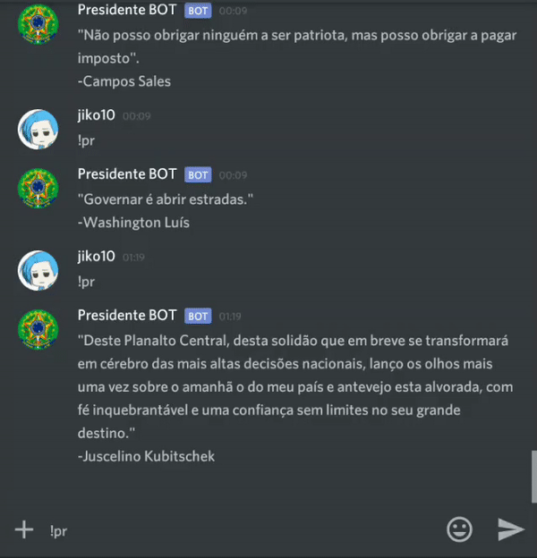

# Presidente BOT :speech_balloon:

Bot do Discord que envia citações aleatórias de ~~quase~~ todos presidentes do Brasil. :mag: :computer:

## Instalação
Acesse [este link](https://discordapp.com/oauth2/authorize?client_id=530209100236324866&scope=bot&permissions=0) para selecionar em qual servidor o **Presidente BOT** deve ser adicionado. Após isso, ele estará configurado e pronto.

## Funcionamento
**Presidente BOT** funciona a partir do comando *!pr* que dispara uma consulta ao [WikiQuotes](https://pt.wikiquote.org/wiki/P%C3%A1gina_principal) e retorna uma citação aleatória de presidentes do Brasil.

### Bibliotecas
Feito com
- [NodeJS](https://nodejs.org/en/)
- [Cheerio](https://github.com/cheeriojs/cheerio) 
- [Discord.JS](https://discord.js.org/#/)

#### Mais
Contribuições são bem-vindas!

:pencil2: **Paulo Viana**
